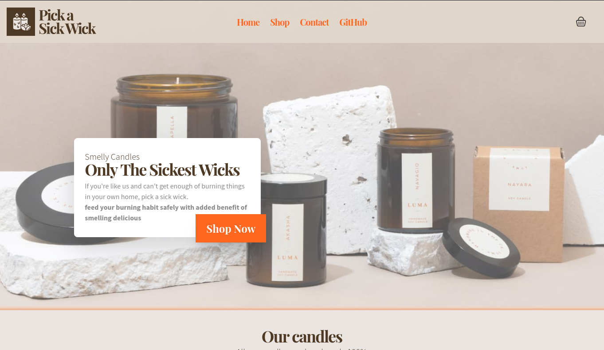
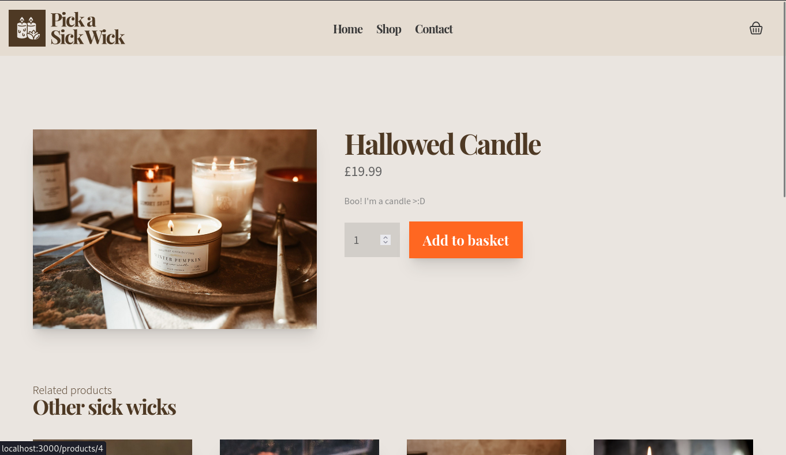
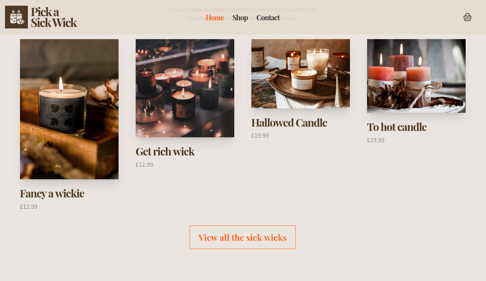

<p align="center">
  <a href="https://nuxt.com/" target="blank"></a>
</p>

<p align="center">
  <a href="#-tecnologias">Tecnologias</a>&nbsp;&nbsp;&nbsp;|&nbsp;&nbsp;&nbsp;
  <a href="#-projeto">Projeto</a>&nbsp;&nbsp;&nbsp;|&nbsp;&nbsp;&nbsp;
  <a href="#-como-executar">Como executar</a>&nbsp;&nbsp;&nbsp;|&nbsp;&nbsp;&nbsp;
  <a href="#-licença">Licença</a>
</p>

<p align="center">
  
</p>

<p align="center">
  
</p>

<p align="center">
    
</p>

<p align="center">
  
</p>

<br>

<a id="-tecnologias"></a>

## ✨ Tecnologias

Esse projeto foi desenvolvido com as seguintes tecnologias:


<a id="-projeto"></a>

## 💻 Projeto

Um e-commerce de velas simples usando o Strapi como principal CMS Headless, o frontend é construído em Vue, mais precisamente em NuxtJS, com o apoio do Framework CSS tailwind para cuidar da parte de CSS do site.

<a id="-como-executar"></a>

## 🚀 Como executar

### 💻 Pré-requisitos

Antes de começar, verifique se você atendeu aos seguintes requisitos:

- Você instalou a versão mais recente de `< NodeJS >`

- Você tem uma máquina `< Windows / Linux / Mac >`.

- Você possui um `< Editor de código ou IDE / Gerenciador de banco de dados >`.

## ☕ Pequena ajuda

Preencha o arquivo `.env.example` com as informações cobradas e depois renomeie para `.env`.

```env
// API_URL sendo o backend desse mesmo repositório
API_URL=http://127.0.0.1:1337/api

```

## Configurando a aplicação antes de iniciar :gear:

Instale os requerimentos do package.json com seu gerenciador de pacotes a disposição

```bash
pnmp install // yarn install // npm install
```

### Se lembre de ter o Docker rodando :ocean:

E então, suba o backend da outra pasta com o comando `docker-compose up --build -V`.

Agora você pode acessar [localhost:1337](localhost:1337) do seu navegador.

Depois de ter configurado todo o Strapi, acesse o front através do link [localhost:3000](localhost:3000)

<a id="licença"></a>

## 📄 Licença

Esse projeto está sob a licença MIT. Veja o arquivo [LICENSE](../LICENSE.md) para mais detalhes.

---

#### _Sinta-se livre para colaborar, toda ajuda é bem vinda ;)_
